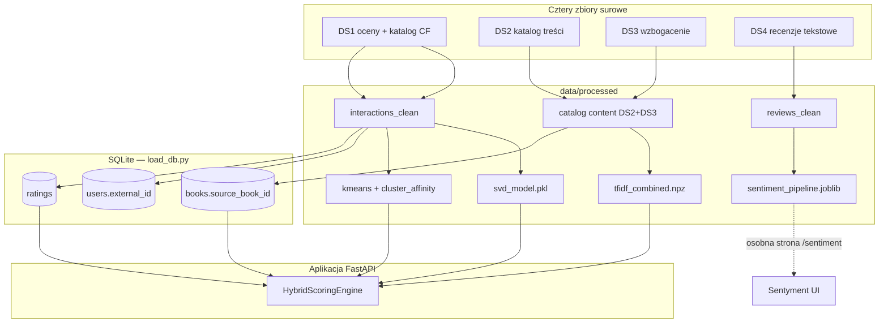
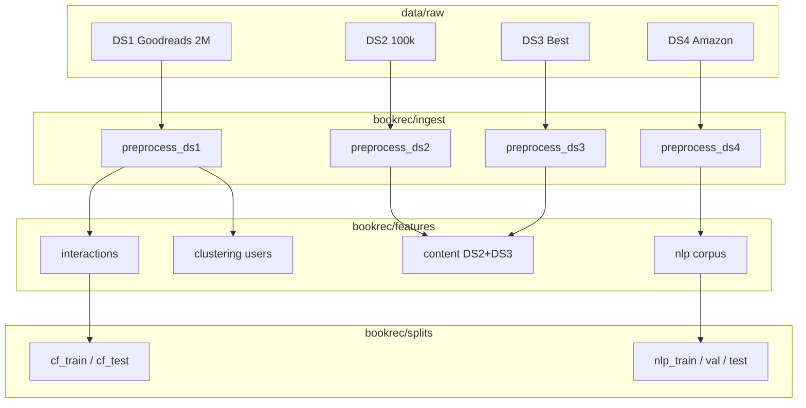
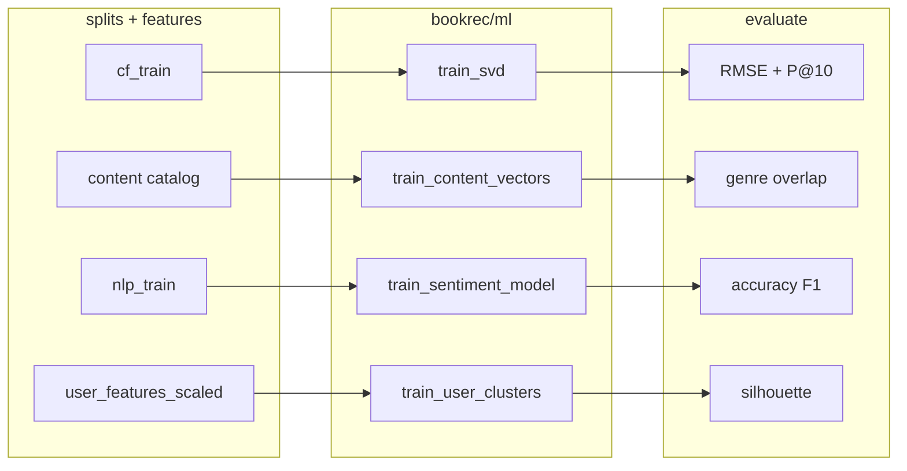
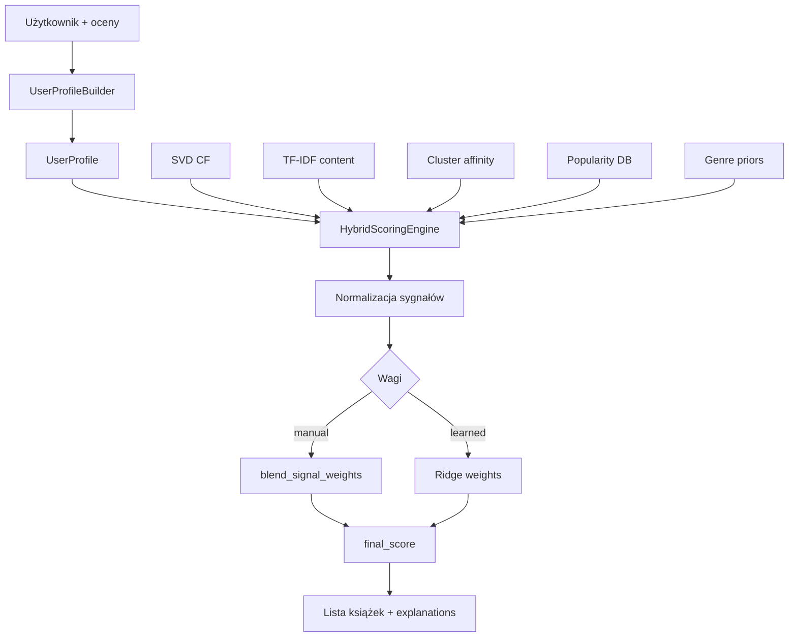

# JoyBookers — pełna dokumentacja projektu

**System rekomendacji książek** — projekt uniwersytecki inspirowany portalem LubimyCzytać.

Autorzy: Kiryl Alishkevich, Damian Kulesza.

Dokument opisuje architekturę repozytorium, zbiory danych, pipeline przetwarzania i uczenia modeli, hybrydowy system rekomendacji, ewaluację oraz osiągnięte wyniki. Uzupełnia [ETAP_DANYCH_I_ML.md](ETAP_DANYCH_I_ML.md) (instrukcje uruchomienia) oraz [SYSTEM_REKOMENDACJI_PL.md](SYSTEM_REKOMENDACJI_PL.md) (szczegóły rekomendacji).

---

## Spis treści

1. [Cel i zakres projektu](#1-cel-i-zakres-projektu)
2. [Struktura repozytorium](#2-struktura-repozytorium)
3. [Zbiory danych](#3-zbiory-danych)
4. [Pipeline danych](#4-pipeline-danych)
5. [Pipeline uczenia maszynowego (ML)](#5-pipeline-uczenia-maszynowego-ml)
6. [System rekomendacji hybrydowy](#6-system-rekomendacji-hybrydowy)
7. [Aplikacja webowa](#7-aplikacja-webowa)
8. [Ewaluacja modeli](#8-ewaluacja-modeli)
9. [Wyniki projektu](#9-wyniki-projektu)
10. [Podsumowanie](#10-podsumowanie)

---

## 1. Cel i zakres projektu

### 1.1 Cel biznesowy i naukowy

JoyBookers to demonstracyjny system rekomendacji książek, który:

- przetwarza **cztery niezależne zbiory** Goodreads / Amazon w ramach ograniczeń sprzętowych (8–16 GB RAM);
- uczy **cztery moduły ML** (CF, treść, sentyment, klasteryzacja użytkowników);
- łączy sygnały w **jedną ścieżkę hybrydową** dla użytkowników DS1 i zarejestrowanych użytkowników aplikacji;
- udostępnia **interfejs webowy** (FastAPI + HTMX) z analityką, klasteryzacją i analizą sentymentu.

### 1.2 Kluczowa decyzja architektoniczna

Zamiast jednego „mega-merge” milionów rekordów Goodreads stosujemy **podział ról zbiorów** (`bookrec/constraints.py`):

| Zbiór | Rola w projekcie |
|-------|------------------|
| DS1 | Wyłącznie filtrowanie współpracujące (SVD) i segmentacja użytkowników (K-Means) |
| DS2 | Główny katalog treściowy (~100k książek) |
| DS3 | Wzbogacenie metadanych (tagi, postacie) scalane z DS2 po `match_key` |
| DS4 | Niezależny NLP / sentyment (recenzje Amazon) |

**Wykluczone:** budowa TF-IDF na pełnym katalogu DS1 (1,5M+ książek) — nie mieści się w RAM i nie jest wymagane merytorycznie.

---

## 2. Struktura repozytorium

### 2.1 Widok katalogów (najważniejsze)

```
JoyBookers/
├── bookrec/              # Biblioteka danych + ML (bez UI)
├── app/                  # Aplikacja FastAPI (API + szablony HTML)
├── scripts/              # Punkty wejścia CLI (pipeline, setup, hybrid)
├── data/
│   ├── raw/              # Surowe CSV/JSON z Kaggle (gitignore dużych plików)
│   └── processed/        # Artefakty po pipeline (modele, cechy, splity)
├── reports/              # Metryki i EDA w git (JSON + miniatury PNG)
├── tests/                # Testy pytest
├── DOKUMENTACJA_PROJEKTU.md   # Ten dokument
├── ETAP_DANYCH_I_ML.md        # Instrukcje uruchomienia i wyniki etapu
└── requirements.txt
```

### 2.2 `bookrec/` — rdzeń pipeline i ML

| Ścieżka | Zawartość |
|---------|-----------|
| `bookrec/ingest/` | Ładowanie i czyszczenie DS1–DS4 (`ds1_goodreads_2m.py` … `ds4_amazon_reviews.py`) |
| `bookrec/pipeline/runner.py` | Orkiestracja: analyze → preprocess → features → splits |
| `bookrec/features/` | Budowa cech: interakcje, klasteryzacja, treść, korpus NLP |
| `bookrec/ml/` | Preprocess / train / evaluate dla 4 modułów ML |
| `bookrec/splits.py` | Podziały train/val/test (CF per-user, NLP stratyfikowany) |
| `bookrec/constraints.py` | Limity RAM i mapowanie ról zbiorów |
| `bookrec/paths.py` | Stałe ścieżek do `data/processed/` |
| `bookrec/schemas.py` | Oczekiwane kolumny per dataset |
| `bookrec/reports_export.py` | Kopia JSON/PNG do `reports/` |
| `bookrec/analysis.py`, `eda.py` | Profilowanie i wykresy EDA |
| `bookrec/title_matching.py` | Dopasowanie tytułów (orphan ratings DS1) |
| `bookrec/resolution/` | Book linker (legacy, poza głównym pipeline) |

### 2.3 `app/` — warstwa produkcyjna

| Ścieżka | Zawartość |
|---------|-----------|
| `app/main.py`, `factory.py` | Uruchomienie FastAPI |
| `app/config.py` | Konfiguracja (`app_name`, ścieżki modeli, limity hybrid) |
| `app/routers/api/` | REST: książki, użytkownicy, oceny, rekomendacje, sentyment |
| `app/routers/web/` | Strony HTML (Jinja2) |
| `app/services/` | Logika biznesowa (`recommendation_service.py`, `reports_service.py`, …) |
| `app/ml/` | Silniki inferencji + **hybryda** (`hybrid_scoring.py`, `user_profile.py`, …) |
| `app/db/` | Modele SQLAlchemy, migracje, SQLite |
| `app/templates/` | Interfejs po polsku |
| `app/static/` | CSS, `charts.js` (Chart.js) |

### 2.4 `scripts/` — punkty wejścia

| Skrypt | Funkcja |
|--------|---------|
| `scripts/run_data_pipeline.py` | → `bookrec.pipeline.runner` |
| `scripts/ml/run_ml_pipeline.py` | → `bookrec.ml.runner` |
| `scripts/setup_all.py` | Pełny łańcuch: dane → ML → hybrid → raporty → SQLite |
| `scripts/load_db.py` | Załadowanie książek/ocen do bazy aplikacji |
| `scripts/export_reports.py` | Odświeżenie `reports/` |
| `scripts/build_cluster_affinity.py` | JSON: klaster → popularność książek |
| `scripts/build_genre_priors.py` | Priory gatunków (globalne / per klaster) |
| `scripts/train_hybrid_weights.py` | Regresja Ridge na sygnałach hybrydowych |
| `scripts/evaluate_hybrid_baselines.py` | Porównanie baseline’ów hybrydy |

### 2.5 `data/processed/` — artefakty (po uruchomieniu pipeline)

| Katalog | Przykładowe pliki |
|---------|-------------------|
| `ds1/` … `ds4/` | `books_clean`, `interactions_clean`, `reviews_clean` |
| `features/` | `interactions/`, `clustering/user_features_scaled`, `content/`, `nlp/` |
| `splits/` | `cf_train`, `cf_test`, `nlp_train`, `nlp_val`, `nlp_test` |
| `models/collaborative/` | `svd_model.pkl` |
| `models/content/` | `tfidf_combined.npz` |
| `models/sentiment/` | `sentiment_pipeline.joblib` |
| `models/clustering/` | `kmeans_model.joblib`, `user_cluster_assignments` |
| `models/hybrid/` | `ridge_weights.joblib` |
| `models/evaluation/` | `evaluate_all.json`, `ml_pipeline_summary.json` |
| `eda/` | Wykresy PNG DS1 |

### 2.6 `reports/` — metryki w repozytorium git

Lustrzane kopie JSON z `data/processed/` — używane przez panel **Analityka** (`/analytics`) bez konieczności ponownego treningu.

---

## 3. Zbiory danych

### 3.1 Jedna aplikacja — cztery źródła, cztery zadania ML

JoyBookers **nie** scala wszystkich CSV w jedną gigantyczną tabelę. Zamiast tego działa jak **platforma rekomendacyjna z wyspecjalizowanymi modułami**, gdzie każdy zbiór Kaggle dostarcza danych do konkretnego algorytmu:

| Zbiór | Co dostarcza | Algorytm | Gdzie widać efekt |
|-------|--------------|----------|-------------------|
| **DS1** | Miliony ocen user×book | SVD + K-Means | Rekomendacje CF, badge klastra, sygnały `cf` i `cluster` |
| **DS2** | Katalog ~100k książek z gatunkami | TF-IDF + cosine | Wyszukiwarka `/books`, „podobne książki”, sygnał `content` |
| **DS3** | Tagi, postacie, serie | Wzbogacenie TF-IDF | Opisy w UI, dodatkowy tekst w wektorze treści |
| **DS4** | Tekst recenzji Amazon | TF-IDF + LogReg | Strona `/sentiment` (osobny moduł rubryki NLP) |

**Dlaczego nie jeden zbiór?**

1. **Różne pytania badawcze** — rubryka wymaga CF, content-based, klasteryzacji i NLP; żaden pojedynczy Kaggle nie ma wszystkiego w jakości nadającej się do treningu.
2. **Różne skale** — DS1 ma 1,5M+ książek; budowa TF-IDF na tym katalogu przekracza RAM (`constraints.py` wyraźnie to wyklucza).
3. **Różne identyfikatory** — Goodreads `book_id` ≠ Amazon `asin`; wymuszony globalny JOIN byłby pełen błędów dopasowania.
4. **Niezależność DS4** — recenzje Amazon nie muszą (i nie powinny) być łączone z Goodreads, żeby moduł sentymentu był poprawny metodologicznie.

### 3.2 Jak cztery zbiory tworzą jeden system — warstwa integracji

Zbiory pozostają **logicznie rozdzielone w pipeline**, ale **łączą się w runtime** przez wspólne klucze i hybrydowy silnik:



#### Kluczowe mechanizmy spójności

| Mechanizm | Plik | Rola w „jednym systemie” |
|-----------|------|---------------------------|
| **`match_key`** | `bookrec/text_normalization.py` | `title_norm + author_norm` — łączy wiersz DS2 z wierszem DS3 przy budowie katalogu treści |
| **`source_book_id`** | katalog content, SQLite `books` | Wspólny identyfikator książki w TF-IDF i w bazie aplikacji; content engine indeksuje po tym polu |
| **`external_id` użytkownika** | `load_db.py` | ID z DS1 (`user_id` z interactions) mapowane na `users.id` w SQLite; CF (SVD) trenowany na tych samych ID |
| **Stub books DS1** | `load_db.py::ensure_ds1_books` | Książki oceniane w DS1, ale brakujące w katalogu DS2, dostają wpis-placeholder — ocena i tak trafia do bazy |
| **`HybridScoringEngine`** | `app/ml/hybrid_scoring.py` | Jedna funkcja `recommend()` łączy sygnały z DS1 (CF, klaster), DS2/DS3 (treść) i SQLite (popularność, gatunki) |
| **Zarejestrowany użytkownik** | `app/ml/user_clustering.py` | Nie pochodzi z DS1, ale korzysta z **tego samego** modelu K-Means i tej samej hybrydy — system jednolity dla demo |

**Przepływ użytkownika końcowego (przykład):**

1. Przegląda katalog z **DS2+DS3** (`/books`).
2. Ocenia książkę → wpis w **SQLite**; klaster przeliczany modelem z **DS1**.
3. Rekomendacja: **CF** (jeśli profil bogaty i user w macierzy SVD) + **TF-IDF** (wektor z ocenionych książek) + **affinity klastra** (statystyki z DS1) + popularność w aplikacji.
4. Opcjonalnie: wkleja recenzję Amazon-style na `/sentiment` — model z **DS4**, bez wpływu na ranking.

### 3.3 Rola każdego zbioru — szczegółowo

#### DS1 — „silnik behawioralny”

- **Unikalna wartość:** jedyne źródło **rzeczywistych interakcji** user×book w skali milionów.
- **W systemie:** trenuje SVD; buduje cechy K-Means; generuje `cluster_affinity.json`; ładuje użytkowników i oceny do SQLite.
- **Czego DS1 nie robi:** nie zasila TF-IDF katalogu (za duży, słabe metadane treściowe w porównaniu z DS2).

#### DS2 — „twarz katalogu”

- **Unikalna wartość:** kompletne metadane (tytuł, autor, gatunek, opis) w rozmiarze możliwym do TF-IDF.
- **W systemie:** po merge z DS3 → macierz `tfidf_combined.npz`; ten sam katalog trafia do SQLite jako lista książek w UI.

#### DS3 — „warstwa wzbogacenia”

- **Unikalna wartość:** tagi, postacie, serie — pola często brakujące w DS2.
- **W systemie:** nie ma własnego modelu; wzbogaca rekord DS2 w `features/content.py::_merge_ds2_ds3_catalog()`; unikalne pozycje tylko-DS3 dodawane do katalogu.

#### DS4 — „moduł językowy”

- **Unikalna wartość:** długi tekst recenzji (NLP).
- **W systemie:** równoległy tor — trening sentymentu, demo w UI; **świadomie odłączony** od hybrydy, bo inna domena i brak pewnego mapowania książka-po-książce z Goodreads.

### 3.4 Ograniczenia współpracy zbiorów (uczciwie)

| Problem | Skutek | Mitigacja w projekcie |
|---------|--------|------------------------|
| DS1 `book_id` ≠ DS2 `source_book_id` | CF i content operują na różnych przestrzeniach ID | SQLite mapuje oba przez `source_book_id`; stub books dla DS1-only |
| Niska pokrywalność DS1↔DS2 po tytule | Część ocen DS1 nie ma bogatego opisu w UI | Placeholder `DS1 book {id}` |
| Brak tekstu recenzji Goodreads | Sentyment tylko z DS4 | Osobny moduł DS4 |
| RAM | Nie da się zmergować wszystkiego | Role w `constraints.py`, sparse matrices, `--ds4-sample` |

### 3.5 Skrót techniczny per zbiór

| Zbiór | Surowe | Wyjście preprocess | Moduł ingest |
|-------|--------|-------------------|--------------|
| DS1 | `data/raw/ds1_goodreads_2m/` | `books_clean`, `interactions_clean` | `ds1_goodreads_2m.py` |
| DS2 | `data/raw/ds2_goodreads_100k/` | `books_clean` | `ds2_goodreads_100k.py` |
| DS3 | `data/raw/ds3_goodreads_best/` | `books_clean` | `ds3_goodreads_best.py` |
| DS4 | `data/raw/ds4_amazon_reviews/` | `reviews_clean` | `ds4_amazon_reviews.py` |

Szczegółowy opis operacji czyszczenia: [sekcja 4.3](#43-czyszczenie-danych-preprocess--szczegółowo).

---

## 4. Pipeline danych

### 4.1 Orkiestracja

**Wejście:** `python scripts/run_data_pipeline.py --stages all`

**Rdzeń:** `bookrec/pipeline/runner.py` — funkcja `run_pipeline()`.

Etapy (w kolejności):

```
analyze → preprocess → features → splits → export_reports()
```

```198:210:bookrec/pipeline/runner.py
def run_pipeline(
    stages: list[str] | None = None,
    *,
    raw_ds1: Path | None = None,
    skip_ds2: bool = False,
    skip_ds3: bool = False,
    skip_ds4: bool = False,
    ds4_sample: int | None = None,
    fuzzy_threshold: int = 88,
) -> dict[str, Any]:
    all_stages = ["analyze", "preprocess", "features", "splits"]
    stages = stages or all_stages
    summary: dict[str, Any] = {"stages_run": stages, "project_scope": schema_roles_summary()}
```

### 4.2 Etap `analyze`

**Funkcja:** `stage_analyze()` — wywołuje `load_and_analyze_ds1` … `ds4`.

**Wyjście:** `data/processed/analysis/analyze_all.json` — statystyki braków, outlierów, liczności.

**Cel:** dokumentacja jakości danych przed obroną; wejście do sekcji „wartości odstające” w panelu analitycznym.

### 4.3 Czyszczenie danych (`preprocess`) — szczegółowo

Etap `preprocess` wywołuje `stage_preprocess()` w `bookrec/pipeline/runner.py`, który dla każdego zbioru uruchamia dedykowaną funkcję `preprocess_ds*()` z modułu `bookrec/ingest/`. Wspólna logika książek i ocen DS1 siedzi w `bookrec/cleaning.py`; normalizacja tekstu i klucze łączenia — w `bookrec/text_normalization.py` i `bookrec/title_matching.py`.

**Wyjście zbiorcze:** `data/processed/analysis/preprocess_summary.json` (raport per zbiór: ile wierszy usunięto i dlaczego).

#### 4.3.1 Wspólne narzędzia (`cleaning.py`, `text_normalization.py`)

| Funkcja | Plik | Co robi |
|---------|------|---------|
| `normalize_column_names()` | `cleaning.py` | Małe litery, spacje→`_`, usuwa zduplikowane kolumny w shardach |
| `apply_book_column_aliases()` | `cleaning.py` | `goodreads_book_id`→`id`, `title`→`name` |
| `apply_rating_column_aliases()` | `cleaning.py` | `userid`→`user_id`, `bookid`→`book_id` |
| `add_match_keys()` | `text_normalization.py` | Dodaje `title_norm`, `title_core`, `author_norm`, **`match_key`** |
| `normalize_review_text()` | `text_normalization.py` | HTML, whitespace, znaki specjalne — dla DS4 |
| `TitleMatcher` | `title_matching.py` | Dopasowanie tytułu oceny do katalogu: exact → core → fuzzy (RapidFuzz) |

**`match_key`** — fundament łączenia DS2 z DS3:

```python
# Uproszczony sens: znormalizowany tytuł + autor
match_key = f"{title_norm}|{author_norm}"
```

Dzięki temu ta sama książka w dwóch exportach Kaggle trafia do jednego rekordu katalogu treści.

#### 4.3.2 DS1 — czyszczenie książek (`clean_books`)

**Plik:** `bookrec/cleaning.py::clean_books()` — wywoływane z `preprocess_ds1()`.

Kolejność operacji:

1. **Normalizacja nazw kolumn** i aliasów.
2. **Puste komórki** → `NaN` (regex `^\s*$`).
3. **`id` książki:** konwersja na liczbę, odrzucenie `id ≤ 0` lub brakujących.
4. **Tytuł (`name`):** wiersze bez tytułu usuwane.
5. **Walidacja numeryczna** (wiersz zachowany, wartość poza zakresem → `NaN`):

   | Kolumna | Dolna granica | Górna granica |
   |---------|---------------|---------------|
   | `publishyear` | 1000 | 3000 |
   | `publishmonth` | 1 | 12 |
   | `publishday` | 1 | 31 |
   | `pagesnumber` | 1 | — |
   | `rating` | 0 | 5 |
   | `countsofreview` | 0 | — |

6. **`parse_rating_distribution_columns()`** — parsuje komórki typu `1:42` z rozkładu gwiazdek.
7. **Deduplikacja** po `id` (pierwszy wiersz wygrywa).

Raport: `books_rows_input`, `books_rows_clean`, `books_duplicate_ids_dropped`.

Po `clean_books`: `add_match_keys()`, `source_book_id = str(id)`, zapis `catalog_link_keys` do późniejszej analizy.

#### 4.3.3 DS1 — czyszczenie interakcji (`clean_interactions`)

**Plik:** `bookrec/cleaning.py::clean_interactions()` — obsługuje **dwa formaty** plików ocen Kaggle:

**Format A — jawne ID** (`user_id`, `book_id`, `rating`):

```182:227:bookrec/cleaning.py
def _clean_interactions_explicit_ids(df, valid_book_ids):
    df = df.replace(r"^\s*$", np.nan, regex=True)
    df["user_id"] = pd.to_numeric(df["user_id"], errors="coerce")
    df["book_id"] = pd.to_numeric(df["book_id"], errors="coerce")
    df["rating"] = pd.to_numeric(df["rating"], errors="coerce")
    df = df.dropna(subset=["user_id", "book_id", "rating"])
    df["rating"] = df["rating"].round().astype("int64")
    df = df[(df["rating"] >= 1) & (df["rating"] <= 5)]
    # sortowanie po timestamp (jeśli jest) → deduplikacja (user, book) keep="last"
    # filtrowanie book_id ∉ valid_book_ids (katalog books_clean)
```

**Format B — tytuły tekstowe** (`id` użytkownika, `name` tytułu, `rating` tekstowy Goodreads):

Mapowanie etykiet tekstowych na 1–5:

| Tekst Goodreads | Gwiazdki |
|-----------------|----------|
| „did not like it” | 1 |
| „it was ok” | 2 |
| „liked it” | 3 |
| „really liked it” | 4 |
| „it was amazing” | 5 |

Następnie `TitleMatcher` łączy `name` z `books_clean.id`:

1. dopasowanie **exact** na znormalizowanym tytule;
2. dopasowanie na **`title_core`** (bez nawiasów serii, bez podtytułu po „:”);
3. **fuzzy** RapidFuzz, próg domyślny **88** (`fuzzy_threshold` w CLI).

Wiersze bez dopasowania tytułu → usunięte (`rows_dropped_no_title_match`).

**Wspólne kroki końcowe (oba formaty):**

- Oceny spoza [1, 5] → usunięte;
- Duplikat `(user_id, book_id)` → zostaje **ostatnia** ocena (po sortowaniu czasowym);
- Tylko `book_id` obecne w `books_clean` (`valid_book_ids`);
- Typy wynikowe: `int32` / `int8` — oszczędność pamięci.

**Opcjonalny filtr rzadkości** w `preprocess_ds1()` (`min_user_ratings`, `min_book_ratings`) — usuwa power-userów lub ultra-rzadkie książki przed CF (domyślnie 0 = bez filtra).

**Outliers:** `detect_interaction_outliers()` — raport do analityki (max ocen/user, cold start).

#### 4.3.4 DS2 — czyszczenie katalogu treści

**Plik:** `bookrec/ingest/ds2_goodreads_100k.py::preprocess_ds2()`

1. **Wczytanie shardów CSV** (`load_csv_shards`) — UTF-8, fallback latin-1.
2. **`standardize_columns`** — mapowanie m.in. `bookid`→`source_book_id`, `name`→`title`, `pages`→`pagesnumber`.
3. **`source_book_id`** wymuszony jako string (identyfikator stabilny w całym systemie).
4. **`fill_missing_strings`** — puste tytuły/autorzy/opisy → `""`; wiersze **bez tytułu usuwane**.
5. **Parsowanie gatunków** — `_parse_list_cell()`: listy Python w stringu, JSON, lub separator `|;,/`.
6. **Walidacja numeryczna:** `pagesnumber ∈ [1, 10000]`, `rating ∈ [0, 5]` — poza zakresem → `NaN`.
7. **ISBN / ISBN13** — usunięcie `.0` z eksportu Excel, puste → `NaN`.
8. **`add_match_keys()`** — klucz do merge z DS3.
9. **`drop_duplicates(subset=["source_book_id"])`**.

#### 4.3.5 DS3 — czyszczenie wzbogacenia

**Plik:** `bookrec/ingest/ds3_goodreads_best.py::preprocess_ds3()`

Analogicznie do DS2, plus:

- Parsowanie list: `genres_list`, `tags_list`, `characters_list`, `places_list`, `awards_list` (kolumny `genres`, `tags`, …).
- Obsługa CSV **lub** JSON/JSONL.
- Po czyszczeniu: `match_key` — ten sam algorytm co DS2, żeby merge w `features/content.py` działał.

DS3 **nie** jest mergowany na etapie preprocess — merge następuje dopiero w `build_content_features()`.

#### 4.3.6 DS4 — czyszczenie recenzji Amazon

**Plik:** `bookrec/ingest/ds4_amazon_reviews.py::preprocess_ds4()`

1. **Wykrycie formatu** — JSON/JSONL lub CSV z kolumną tekstu (`review/text`, `reviewText`, …).
2. **Standaryzacja kolumn** — `review_text`, `star_rating`, `reviewer_id`, `asin`.
3. **`normalize_review_text()`** — bez wymuszania lowercase (zachowanie wielkości liter dla klasyfikatora).
4. **Długość tekstu:** `min_text_len=20`, `max_text_len=15000` — odfiltrowanie spamu i outlierów długości.
5. **Gwiazdki:** numeryczne 1–5; poza zakresem → usunięte.
6. **Etykieta sentymentu** (`_star_to_sentiment`):

   - ≥ 4.0 → `1` (pozytywna);
   - ≤ 2.0 → `0` (negatywna);
   - 3★ → `None` → **wiersz usunięty** (`rows_dropped_neutral_sentiment`).

   **Dlaczego wycinamy 3★?** Binarowy klasyfikator nie ma klasy neutralnej; 3★ to szum etykiety przy mapowaniu gwiazdek→sentyment.

7. **Opcjonalna próbka** `sample_n` — losowanie wierszy (`random_state=42`).
8. **Deduplikacja** po `(reviewer_id, review_text_clean)`.
9. Raport: `rating_outliers`, `text_outliers` — do panelu analityki.

**Ważne:** brak JOIN z Goodreads — `asin` Amazon służy tylko identyfikacji w DS4.

#### 4.3.7 Merge DS2+DS3 (etap `features`, nie `preprocess`)

Po czyszczeniu obu katalogów, `bookrec/features/content.py::_merge_ds2_ds3_catalog()`:

1. Bierze **DS2 jako bazę** każdego rekordu.
2. Dla każdego `match_key` szuka wiersza DS3 → dokleja `tags`, `characters`, dodatkowe gatunki.
3. Wiersze DS3 **bez** odpowiednika w DS2 → dodawane jako osobne pozycje (`ds3_only_rows`).
4. Składa **`content_text`** = tytuł + autor + opis + gatunki + tagi + postacie (max 15 postaci).
5. Ogranicza rozmiar do `MAX_CONTENT_BOOKS` (160k).

To jest moment, w którym DS2 i DS3 **fizycznie stają się jednym katalogiem treści** dla TF-IDF i SQLite.

#### 4.3.8 Ładowanie do SQLite (`scripts/load_db.py`)

Ostatni krok „spajania” przed UI:

| Krok | Co łączy |
|------|----------|
| `load_books(catalog_path)` | Katalog content (DS2+DS3 merge) → tabela `books` |
| `ensure_ds1_books()` | ID książek z ocen DS1 bez wpisu w katalogu → stub |
| `load_users(interactions)` | `user_id` z DS1 → `users.external_id` |
| `load_ratings()` | Triplety DS1 → `ratings` z mapowaniem na `books.id` i `users.id` |
| `backfill_all_book_rating_stats()` | Agregaty `rating_count`, `db_avg_rating` w UI |

**Most ID:** `source_book_id` (string) w SQLite = klucz w macierzy TF-IDF = `book_id` w interactions DS1 (po mapowaniu przez `ensure_ds1_books`).

#### 4.3.9 Parametry CLI preprocess

| Parametr | Domyślnie | Uzasadnienie |
|----------|-----------|--------------|
| `fuzzy_threshold` | 88 | RapidFuzz 0–100; 88 odcina większość błędnych dopasowań tytułów |
| `ds4_sample` | None | Przy braku RAM: np. `--ds4-sample 100000` |
| `skip_ds2/3/4` | False | Szybki test tylko DS1 |
| `enable_fuzzy` | True | Wyłączenie → tylko exact match tytułów (szybciej, więcej strat) |

### 4.4 Etap `features`

**Funkcja:** `stage_features()` — **bez globalnego merge** wszystkich tabel.

```133:180:bookrec/pipeline/runner.py
def stage_features(preprocess_results: dict[str, Any] | None = None) -> dict[str, Any]:
    """Build module-specific features — no cross-dataset mega-merge."""
    ...
        report["interactions"] = build_interaction_features(...)
        report["clustering"] = build_user_clustering_features(...)
    ...
    report["content"] = build_content_features(ds2, ds3, PROC_FEATURES / "content")
    ...
        report["nlp"] = build_nlp_corpus_features(reviews, PROC_FEATURES / "nlp")
```

#### 4.4.1 Cechy interakcji (`features/interactions.py`)

Statystyki macierzy user×book: liczba interakcji, cold start (książki/użytkownicy z 1 oceną), rozkłady — wejście do raportów i analityki.

#### 4.4.2 Cechy klasteryzacji (`features/clustering.py`)

**Funkcja:** `build_user_clustering_features(interactions, out_dir, min_ratings=3)`

Cechy per użytkownik:

- `n_ratings`, `mean_rating`, `std_rating`, `min_rating`, `max_rating`, `rating_range`;
- `activity_level` (low / medium / high) + one-hot `activity_*`.

Użytkownicy z &lt; 3 ocenami **odrzuceni** — K-Means na pojedynczej ocenie jest niestabilny.

#### 4.4.3 Cechy treści (`features/content.py`)

Scala DS2+DS3, buduje ramkę katalogową z polami: autor, gatunek, opis, tagi (jeśli są), `match_key`, `source_book_id`.

Limit: `MAX_CONTENT_BOOKS = 160_000` (`constraints.py`).

#### 4.4.4 Korpus NLP (`features/nlp_corpus.py`)

Przygotowuje kolumny tekstowe i etykiety dla DS4.

**Wyjście zbiorcze:** `data/processed/features/features_summary.json`

### 4.5 Etap `splits`

**Funkcja:** `stage_splits()` → `bookrec/splits.py::save_all_splits()`

#### CF (DS1) — `split_interactions_per_user`

```42:75:bookrec/splits.py
def split_interactions_per_user(
    interactions: pd.DataFrame,
    test_ratio: float = 0.2,
    random_state: int = 42,
    min_user_ratings: int = 2,
) -> tuple[pd.DataFrame, pd.DataFrame, dict[str, Any]]:
    """Hold out a fraction of each user's ratings for CF evaluation."""
```

**Dlaczego per-user holdout?** Symuluje rzeczywisty scenariusz: model widzi część historii użytkownika i przewiduje resztę. Globalny losowy split zawyżałby metryki (ten sam user w train i test).

**Parametry:** `test_ratio=0.2`, `random_state=42` — reprodukowalność.

#### NLP (DS4) — split stratyfikowany

`_stratified_split_indices()` — zachowanie proporcji klas pozytywna/negatywna w train/val/test (DS4 jest silnie niezbalansowany: ~86% pozytywnych w teście).

**Wyjście:** `data/processed/splits/` — pliki parquet/CSV + `splits_summary.json`

### 4.6 Diagram pipeline danych



---

## 5. Pipeline uczenia maszynowego (ML)

### 5.1 Orkiestracja

**Wejście:** `python scripts/ml/run_ml_pipeline.py --stages all`

**Rdzeń:** `bookrec/ml/runner.py`

```62:96:bookrec/ml/runner.py
def run_ml_pipeline(
    stages: list[str],
    *,
    module: str | None = None,
) -> dict[str, Any]:
    ...
    if "train" in stages:
        summary["train"] = train_all()
    if "evaluate" in stages:
        summary["evaluate"] = evaluate_all()
        merged = build_evaluate_all_summary()
        write_json(merged, MODEL_EVAL_DIR / "evaluate_all.json")
```

Etapy per moduł: **preprocess → train → evaluate**.

Flaga `--module collaborative|content|sentiment|clustering` — trening pojedynczego modułu.

### 5.2 Moduł 1: Filtrowanie współpracujące (SVD)

| Aspekt | Szczegóły |
|--------|-----------|
| Pliki | `bookrec/ml/collaborative/{preprocess,train,evaluate}.py` |
| Algorytm | **Surprise SVD** (matrix factorization) |
| Dane | `data/processed/splits/cf_train` |
| Artefakt | `data/processed/models/collaborative/svd_model.pkl` |

**Trening** — `train_svd()`:

```18:44:bookrec/ml/collaborative/train.py
def train_svd(
    ...
    n_factors: int = 100,
    n_epochs: int = 20,
    lr_all: float = 0.005,
    reg_all: float = 0.02,
    random_state: int = 42,
    internal_val_ratio: float = 0.1,
) -> dict[str, Any]:
    ...
    model = SVD(
        n_factors=n_factors,
        n_epochs=n_epochs,
        lr_all=lr_all,
        reg_all=reg_all,
        random_state=random_state,
    )
    model.fit(trainset)
```

**Uzasadnienie hiperparametrów:**

| Parametr | Wartość | Dlaczego |
|----------|---------|----------|
| `n_factors` | 100 | Kompromis między pojemnością a przeuczeniem na rzadkiej macierzy; 50 daje gorsze RMSE w eksperymentach |
| `n_epochs` | 20 | Surprise domyślnie szybko zbiega; więcej epoch → ryzyko overfit bez early stopping |
| `reg_all` | 0.02 | L2 na czynniki — stabilizacja przy milionach par |
| `lr_all` | 0.005 | Standardowy SGD Surprise dla rating prediction |

**Ewaluacja** — `evaluate_svd()`:

- **RMSE / MAE** na `cf_test` — standardowe metryki regresji ocen (skala 1–5);
- **Precision@10 / Recall@10** — ranking: czy prawdziwa ocena testowa jest w top-10 rekomendacji (max 500 użytkowników próbki ze względu na koszt).

**Dlaczego RMSE + ranking?** RMSE mierzy dokładność predykcji gwiazdek; Precision@K mierzy użyteczność listy rekomendacji — oba wymagane w rubryce obrony.

### 5.3 Moduł 2: Rekomendacja treściowa (TF-IDF)

| Aspekt | Szczegóły |
|--------|-----------|
| Pliki | `bookrec/ml/content/{preprocess,train,evaluate}.py` |
| Algorytm | **TF-IDF** (bloki: autorzy, gatunki, tekst) + **cosine similarity** |
| Artefakt | `tfidf_combined.npz` (sparse CSR) |

**Hiperparametry** (`content/train.py`, `constraints.py`):

| Blok | max_features | Uzasadnienie |
|------|--------------|--------------|
| Autorzy | 3 000 | Wysoka kardynalność nazwisk |
| Gatunki | 500 | Ograniczona liczba etykiet |
| Tekst (opis) | 5 000 | `DEFAULT_MAX_TEXT_FEATURES` — limit słownictwa przy ~150k książek |
| Tagi DS3 | 5 000 (max) | W praktyce 0 po merge — dokumentowane w raporcie |

Wiersze macierzy **L2-normalizowane** — iloczyn skalarny = cosinus.

**Ewaluacja** — `evaluate_content_vectors()`:

```25:34:bookrec/ml/content/evaluate.py
def evaluate_content_vectors(
    ...
    sample_size: int = 500,
    top_k: int = 10,
    random_state: int = 42,
) -> dict[str, Any]:
    """Mean genre overlap@K and mean cosine similarity on a random book sample."""
```

**Dlaczego genre overlap@10, a nie RMSE?** Moduł treściowy nie przewiduje ocen — zwraca sąsiadów. Genre overlap mierzy **spójność semantyczną** sąsiedztwa (czy podobne książki mają wspólne gatunki). Mean cosine potwierdza, że wektory są rzeczywiście blisko w przestrzeni TF-IDF.

### 5.4 Moduł 3: Sentyment (DS4)

| Aspekt | Szczegóły |
|--------|-----------|
| Pliki | `bookrec/ml/sentiment/{preprocess,train,evaluate}.py` |
| Algorytm | **TfidfVectorizer** + **LogisticRegression** (Pipeline sklearn) |
| Artefakt | `sentiment_pipeline.joblib` |

**Hiperparametry** (`sentiment/train.py`):

| Parametr | Wartość | Uzasadnienie |
|----------|---------|--------------|
| `max_features` | 20 000 | Duży słownik recenzji Amazon |
| `ngram_range` | (1, 2) | Bigramy łapią „not good”, „waste of time” |
| `min_df` | 2 | Odfiltrowanie hapaksów |
| `sublinear_tf` | True | Tłumienie bardzo częstych słów |
| `C` | 1.0 | Domyślna regularyzacja L2 LR |
| `class_weight` | balanced | DS4 silnie niezbalansowany |

**Ewaluacja:** accuracy, precision/recall/F1 macro na `nlp_test` — standard klasyfikacji binarnej.

### 5.5 Moduł 4: Klasteryzacja użytkowników (K-Means)

| Aspekt | Szczegóły |
|--------|-----------|
| Pliki | `bookrec/ml/clustering/{preprocess,train,evaluate,profiles,viz}.py` |
| Algorytm | **K-Means** (sklearn) na standaryzowanych cechach |
| Artefakt | `kmeans_model.joblib` |

**Wybór k** — `_pick_k()` w `clustering/train.py`:

```19:38:bookrec/ml/clustering/train.py
def _pick_k(
    features: np.ndarray,
    k_range: range,
    random_state: int,
) -> tuple[int, dict[int, float]]:
    ...
        sil = safe_silhouette(features, labels)
        if sil > best_score:
            best_k = k
```

- Przeszukiwany zakres **k ∈ [3, 12]**;
- Kryterium: **maksymalny silhouette score** (miara separacji klastrów);
- Wybrane **k = 3** (silhouette ≈ 0,470).

**Dlaczego silhouette, nie elbow?** Elbow na inertia bywa niejednoznaczny przy wielowymiarowych cechach; silhouette daje jedną liczbę do porównania k i jest czytelny na obronie.

**Dodatkowe artefakty:**

- `profiles.py` — opisy klastrów po polsku z metryk (`describe_cluster_pl`);
- `viz.py` — PCA 2D, histogram aktywności → `pca_viz.joblib` dla dashboardu `/clustering`.

### 5.6 Artefakty po ML (poza `bookrec/ml`)

Po `run_ml_pipeline.py` uruchamia się (przez `setup_all.py`):

1. **`build_cluster_affinity.py`** — dla każdego klastra: średnia ocena / liczność interakcji per `source_book_id` z DS1;
2. **`build_genre_priors.py`** — rozkłady gatunków globalne i per klaster (cold-start);
3. **`train_hybrid_weights.py`** — Ridge na macierzy sygnałów (patrz sekcja 6).

### 5.7 Diagram pipeline ML



---

## 6. System rekomendacji hybrydowy

### 6.1 Filozofia: jedna ścieżka dla wszystkich użytkowników

Wcześniejsze podejście „osobna logika dla DS1 vs zarejestrowanych” zastąpiono **unified hybrid recommender**:

- ten sam `HybridScoringEngine` dla użytkownika DS1 (po ID w SQLite) i zarejestrowanego (`/me`);
- adaptacyjne wagi ręczne zależne od liczby ocen;
- opcjonalnie wagi **uczone Ridge** gdy CF jest dostępne;
- wyjaśnienia po polsku (`app/ml/explanations.py`).

**Wejście API/UI:** `RecommendationService.recommend_for_user()` (`app/services/recommendation_service.py`).

### 6.2 Pięć sygnałów (`app/ml/signals.py`)

| Sygnał | Klucz | Źródło | Opis |
|--------|-------|--------|------|
| Collaborative | `cf` | Surprise SVD | Predykcja oceny dla (user, book) |
| Content | `content` | TF-IDF cosine | Podobieństwo do profilu treściowego użytkownika |
| Cluster | `cluster` | `ClusterAffinityStore` | Popularność książki w segmencie użytkownika |
| Popularity | `pop` | SQLite agregaty | `rating_count`, `db_avg_rating` |
| Genre | `genre` | Profil gatunków / priory | Dopasowanie gatunków książki do historii |

### 6.3 Profil użytkownika

**Klasa:** `UserProfile` + `UserProfileBuilder` (`app/ml/user_profile.py`)

Pola: `rated_books`, `cluster_id`, `genre_weights`, `cf_available`, `content_vector`, `profile_strength`.

**Przypisanie klastra online:** `UserClusteringEngine.predict_cluster()` — te same cechy co przy treningu K-Means, aktualizacja po każdej ocenie w aplikacji.

### 6.4 Adaptacyjne wagi ręczne

**Funkcja:** `blend_signal_weights(profile)`:

```94:115:app/ml/user_profile.py
def blend_signal_weights(profile: UserProfile) -> dict[str, float]:
    n = len(profile.rated_books)
    if n == 0:
        base = {"cf": 0.0, "content": 0.0, "cluster": 0.30, "pop": 0.45, "genre": 0.25}
    elif n <= 2:
        base = {"cf": 0.0, "content": 0.50, "cluster": 0.20, "pop": 0.20, "genre": 0.10}
    elif n < 10:
        base = {"cf": 0.25, "content": 0.45, "cluster": 0.15, "pop": 0.10, "genre": 0.05}
    else:
        base = {"cf": 0.40, "content": 0.35, "cluster": 0.15, "pop": 0.05, "genre": 0.05}
```

**Uzasadnienie:**

- **0 ocen:** brak wektora treści i CF → dominują klaster + popularność + priory gatunków (cold-start);
- **1–2 oceny:** treść już sensowna, CF często niedostępny dla nowych ID;
- **10+ ocen:** CF ma największą wagę — wystarczająca gęstość profilu.

Gdy `cf_available=False`, udział CF jest **redystrybuowany** (60% treść, 25% klaster, 15% pop).

### 6.5 Silnik hybrydowy — przepływ

**Klasa:** `HybridScoringEngine.recommend()` (`app/ml/hybrid_scoring.py`)

```58:148:app/ml/hybrid_scoring.py
    def recommend(self, profile: UserProfile, *, limit: int) -> list[ScoredCandidate]:
        ...
        candidates = self._gather_candidates(profile, rated_ids, limit=limit)
        ...
        cf_norm = self._normalize_dict(cf_scores)
        content_norm = self._normalize_dict(content_scores)
        ...
        manual_score = sum(manual_weights[k] * breakdown[k] for k in breakdown)
        if use_ridge:
            ridge_score = self.weight_model.score(ridge_feats)
            if ridge_score > 0:
                final = ridge_score
            else:
                final = manual_score
        ...
        explanations = build_explanations(profile, breakdown, book_genre=...)
```

Kroki:

1. **Zbierz kandydatów** — union: top CF, sąsiedzi treściowi, affinity klastra, starter books (limit `hybrid_candidate_limit`, domyślnie 2500);
2. **Oblicz surowe sygnały** per `source_book_id`;
3. **Min-max normalizacja** per żądanie (0–1 w obrębie listy kandydatów);
4. **Score:** `manual` LUB `Ridge` jeśli model załadowany **i** `profile.cf_available` **i** `ridge_score > 0`;
5. **Wyjaśnienia** — do 3 zdań PL dla sygnałów ≥ 0.45 w breakdown.

**Dlaczego min-max per request?** Sygnały mają różne skale (CF ~1–5, cosine 0–1). Normalizacja w obrębie kandydatów umożliwia fair blend bez globalnych statystyk online.

**Dlaczego Ridge tylko przy CF?** Ridge trenowany na parach z historii DS1; bez CF wektor cech jest zerowy po wymiarze `cf` — manual blend jest stabilniejszy.

### 6.6 Uczenie wag Ridge

**Skrypt:** `scripts/train_hybrid_weights.py`

- **Model:** `sklearn.linear_model.Ridge(alpha=1.0)`;
- **Cechy:** `[cf, content, cluster, pop, genre]` — surowe (jak w `_ridge_features`);
- **Cel:** `(rating - 1) / 4` → skala [0, 1];
- **Próba:** 12 000 par, split 80/20;
- **Wyjście:** `data/processed/models/hybrid/ridge_weights.joblib`.

**Uzasadnienie Ridge zamiast np. XGBoost:** Mało cech (5), interpretowalne współczynniki, brak przeuczenia na małej próbce, zgodność z wymaganiami rubryki „regresja wag”.

### 6.7 Tryby algorytmu w UI

| Wartość `algorithm` | Zachowanie |
|---------------------|------------|
| `auto` / `hybrid` | Pełny `HybridScoringEngine` |
| `collaborative` | Tylko CF (`recommend_cf_only`) |
| `content` | Tylko treść (`recommend_content_only`) |

### 6.8 Diagram systemu rekomendacji



---

## 7. Aplikacja webowa

### 7.1 Stack

- **FastAPI** — API + render Jinja2;
- **SQLite** — katalog, oceny, użytkownicy zarejestrowani, historia rekomendacji;
- **HTMX** — dynamiczne formularze bez SPA;
- **Bootstrap 5 + Chart.js** — UI i wykresy;
- Język interfejsu: **polski**.

### 7.2 Główne trasy

| Ścieżka | Funkcja |
|---------|---------|
| `/` | Strona główna, skróty do modułów |
| `/books` | Wyszukiwarka katalogu DS2+DS3 |
| `/books/similar` | Sąsiedzi TF-IDF |
| `/recommendations` | Formularz hybrydy (user ID DS1) |
| `/users` | Przegląd użytkowników DS1 |
| `/me` | Profil zarejestrowanego + oceny + rekomendacje |
| `/clustering` | Dashboard K-Means, PCA, formularz demo |
| `/sentiment` | Klasyfikacja recenzji DS4 |
| `/analytics` | Metryki pipeline, selekcja cech, outliery, EDA |
| `/docs` | OpenAPI (Swagger) |

### 7.3 Pełny setup

```powershell
python scripts/setup_all.py
uvicorn app.main:app --reload
```

Kolejność w `setup_all.py`:

1. `run_data_pipeline.py --stages all`
2. `run_ml_pipeline.py --stages all`
3. `build_cluster_affinity.py`
4. `build_genre_priors.py`
5. `train_hybrid_weights.py`
6. `evaluate_hybrid_baselines.py`
7. `export_reports.py`
8. `load_db.py --books-limit 20000 --ratings-limit 50000`

---

## 8. Ewaluacja modeli

Źródło liczb: `reports/ml/evaluation/evaluate_all.json`, `reports/ml/evaluation/hybrid/baseline_comparison.json` (ostatni przebieg w repozytorium).

### 8.1 Filtrowanie współpracujące (SVD)

| Metryka | Wartość | Interpretacja |
|---------|---------|---------------|
| Wiersze testowe | 46 080 | Per-user holdout 20% |
| **RMSE (test)** | **0,890** | Błąd ~0,9 gwiazdki na skali 1–5 — typowy dla rzadkiej macierzy |
| **MAE (test)** | **0,706** | Średni błąd bezwzględny |
| **Precision@10** | **0,56%** | Niski — cold start i ogromna przestrzeń książek |
| **Recall@10** | **0,66%** | Zgodnie z rzadkością trafień w top-10 |

**Walidacja wewnętrzna (train):** RMSE val ≈ 0,882 (`train_report.json`).

### 8.2 Treść (TF-IDF)

| Metryka | Wartość |
|---------|---------|
| Książki w macierzy | 149 342 |
| Próba ewaluacji | 500 książek |
| Top-K | 10 |
| **Genre overlap@10** | **71,4%** |
| **Średni cosine sąsiadów** | **0,633** |

Wysoki overlap potwierdza, że sąsiedzi TF-IDF są semantycznie spójni (gatunki).

### 8.3 Sentyment (DS4)

| Metryka | Wartość |
|---------|---------|
| Wiersze testowe | 188 708 |
| **Accuracy** | **91,8%** |
| Precision macro | 0,811 |
| Recall macro | 0,915 |
| **F1 macro** | **0,850** |

Klasa negatywna (mniej liczna) ma niższą precision (0,64) — typowe przy niezbalansowaniu mimo `class_weight=balanced`.

### 8.4 Klasteryzacja (K-Means)

| Metryka | Wartość |
|---------|---------|
| Użytkownicy (≥3 oceny) | 3 311 |
| **k** | **3** |
| **Silhouette** | **0,470** |
| Inertia | 10 552,5 |

**Profile klastrów (średnie):**

| Klaster | Użytk. | Śr. liczba ocen | Śr. ocena | Charakter (z metryk) |
|---------|--------|-----------------|-----------|----------------------|
| 0 | 1 378 (41,6%) | ~149 | 3,82 | Aktywni czytelnicy |
| 1 | 611 (18,5%) | ~6 | 4,14 | Okazjonalni, hojni w gwiazdkach |
| 2 | 1 322 (39,9%) | ~20 | 4,02 | Umiarkowana aktywność |

### 8.5 Hybryda — porównanie baseline’ów

Ewaluacja: `evaluate_hybrid_baselines.py` — 8 000 par, 1 600 testowych; cel znormalizowany (rating−1)/4.

| Baseline | RMSE | MAE |
|----------|------|-----|
| cf_only | 0,170 | 0,134 |
| content_only | 0,724 | 0,677 |
| cluster_only | 0,668 | 0,610 |
| popularity_only | 0,735 | 0,689 |
| manual_hybrid_blend | 0,544 | 0,500 |
| **learned_ridge_hybrid** | **0,154** | **0,118** |

**Wnioski:**

- Pojedyncze sygnały treści/popularności słabo przewidują ocenę użytkownika wprost;
- CF alone jest silny na użytkownikach DS1 obecnych w macierzy;
- **Ridge łączący sygnały** znacząco poprawia RMSE względem ręcznego blendu — uzasadnia hybrydę;
- W runtime **manual blend** pozostaje fallbackiem (nowi użytkownicy, brak CF, ujemne predykcje Ridge).

### 8.6 Metody ewaluacji — podsumowanie

| Moduł | Metryki | Dlaczego te metryki |
|-------|---------|---------------------|
| CF | RMSE, MAE, P@K, R@K | Regresja ocen + jakość listy |
| Content | Genre overlap@K, cosine | Brak ground-truth „oceny podobieństwa” |
| Sentiment | Accuracy, F1 macro | Klasyfikacja binarna z niezbalansowaniem |
| Clustering | Silhouette, inertia, profile | Jakość segmentacji + interpretowalność |
| Hybrid | RMSE/MAE na znormalizowanej ocenie | Porównanie blendów na tych samych parach |

---

## 9. Wyniki projektu

### 9.1 Zrealizowane komponenty

| Obszar | Status |
|--------|--------|
| Pipeline danych DS1–DS4 | ✓ analyze, preprocess, features, splits |
| 4 moduły ML | ✓ SVD, TF-IDF, LR sentyment, K-Means |
| Hybrydowy recommender | ✓ 5 sygnałów, manual + Ridge, wyjaśnienia PL |
| Aplikacja webowa | ✓ katalog, rekomendacje, klasteryzacja, sentyment, analityka |
| Użytkownicy zarejestrowani | ✓ oceny, auto-klaster, spersonalizowane listy |
| Raporty obronne | ✓ `reports/`, selekcja cech, outliery, wykresy EDA |
| Testy automatyczne | ✓ pytest (pipeline smoke, API, hybrid, clustering) |
| Dokumentacja PL | ✓ ten dokument, ETAP_DANYCH_I_ML, SYSTEM_REKOMENDACJI_PL |

### 9.2 Metryki jakości (skrót)

- CF RMSE **0,89** — akceptowalne dla academic CF na Goodreads;
- Content overlap@10 **71%** — silna spójność gatunkowa;
- Sentiment **92%** accuracy — moduł NLP gotowy do demo;
- K-Means silhouette **0,47** — wyraźna struktura 3 segmentów;
- Hybrid Ridge RMSE **0,15** (znormalizowane) — skuteczne łączenie sygnałów.

### 9.3 Ograniczenia i znane problemy

1. **Niska Precision@10 CF** — inherentna rzadkość; hybryda i treść kompensują w UI.
2. **Brak globalnego linkowania DS1↔DS2** — CF działa na ID DS1, katalog treści na `source_book_id` DS2/DS3; mapowanie w SQLite przy `load_db.py`.
3. **Tagi DS3** często puste po merge — blok tagów TF-IDF nieużywany.
4. **DS4 odłączony od rekomendacji** — sentyment edukacyjny / osobny moduł rubryki.
5. **Ridge może dawać wartości ujemne** — runtime przełącza na manual blend (`ridge_score > 0`).
6. **`bookrec/resolution/book_linker`** — istnieje, ale nie w głównym pipeline produkcyjnym.

### 9.4 Możliwe kierunki rozwoju

- Implicit feedback (polubienia, wishlist) z DS1;
- Re-ranking listy hybrydowej modelem LTR;
- SHAP zamiast heurystycznych wyjaśnień;
- Redukcja rozmiaru `evaluate_all.json` (PCA points) przed commitem;
- Deploy z PostgreSQL zamiast SQLite.

---

## 10. Podsumowanie

JoyBookers realizuje **wieloźródłowy system rekomendacji książek** z jasnym podziałem ról czterech zbiorów Kaggle, ograniczeniami RAM i pełnym łańcuchem:

**surowe dane → `bookrec` pipeline → trening ML → artefakty hybrid → SQLite → FastAPI**.

Kluczowe algorytmy: **SVD, TF-IDF+cosine, Logistic Regression, K-Means, Ridge regression**. Ewaluacja dobiera metryki do typu zadania (regresja ocen, spójność sąsiedztwa, klasyfikacja, segmentacja, blend sygnałów).

System jest gotowy do demonstracji obrony: uruchomienie `setup_all.py`, przegląd `/analytics` i `/clustering`, generowanie rekomendacji dla użytkownika DS1 lub konta `/me`.

---

*Ostatnia aktualizacja dokumentu: czerwiec 2026 — zgodnie ze stanem repozytorium JoyBookers.*
