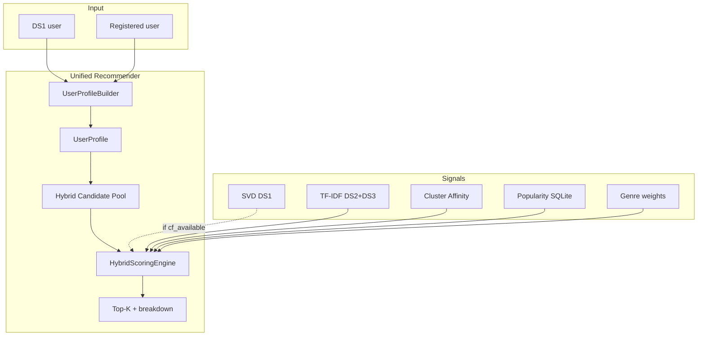

# Система рекомендаций JoyBookers — подробный отчёт

**Версия:** актуальна на момент внедрения unified hybrid recommender  
**Аудитория:** защита проекта, разработка, демонстрация преподавателю  
**Связанный код:** `app/services/recommendation_service.py`, `app/ml/user_profile.py`, `app/ml/hybrid_scoring.py`

---

## 1. Краткое резюме

В проекте реализована **единая гибридная система рекомендаций** для всех типов пользователей.

| Вопрос | Ответ |
|--------|--------|
| Один алгоритм или разные ветки? | **Один pipeline** — `build profile → candidates → hybrid score → rank` |
| Есть ли отличия DS1 vs зарегистрированный? | **Один код**, но **разная доступность сигналов** (главное — CF только для DS1) |
| Cold start — отдельная система? | **Нет** — это sparse user profile в той же формуле |
| Что видит пользователь в UI? | `algorithm: hybrid`, профиль, breakdown по сигналам (C/F/K/P) |

---

## 2. Типы пользователей

### 2.1. Пользователи из датасета (DS1)

| Поле | Значение |
|------|----------|
| Источник | `scripts/load_db.py` ← `interactions_indexed.parquet` (DS1 Goodreads 2M) |
| Флаг БД | `users.is_registered = False` |
| `external_id` | ID пользователя из DS1 (числовой, совпадает с train SVD) |
| `display_name` | «User {external_id}» |
| Оценки | `ratings.source = "ds1"` |
| UI | `/users`, `/users/{id}`, `/recommendations` |

### 2.2. Зарегистрированные пользователи

| Поле | Значение |
|------|----------|
| Источник | `/register`, `POST /api/v1/auth/register` |
| Флаг БД | `users.is_registered = True` |
| `external_id` | `reg:xxxxxxxx` (UUID, **нет в обучающей выборке SVD**) |
| `nickname` | Уникальный никнейм |
| Оценки | Создаются через `/me`, API `/api/v1/ratings/me` |
| UI | `/me`, блок «Recommended for you» |

---

## 3. Главный принцип: один pipeline, адаптивные сигналы

Оба типа пользователей проходят **один и тот же** код:

```
RecommendationService.recommend_for_user()
        │
        ▼
UserProfileBuilder.build(user_id)     ← единое представление пользователя
        │
        ▼
HybridScoringEngine.recommend(profile) ← единая формула скоринга
        │
        ▼
top-K книг + score_breakdown + profile summary
```

**Отличие не в ветках `if registered`, а в том, какие сигналы активны** для конкретного профиля (`cf_available`, число оценок, наличие книг в TF-IDF-матрице).

---

## 4. Единый пользовательский профиль (`UserProfile`)

Строится в `app/ml/user_profile.py` → `UserProfileBuilder.build()`.

### 4.1. Состав профиля

| Компонент | Описание | Источник данных |
|-----------|----------|-----------------|
| `rated_books` | До 500 последних оценок с жанрами | SQLite `ratings` + `books` |
| `cluster_id` | Кластер K-Means (0, 1 или 2) | `UserClusteringEngine.predict_cluster()` |
| `cluster_label` | Человекочитаемая метка | `CLUSTER_LABELS` в `user_clustering.py` |
| `genre_weights` | Нормализованные веса жанров | Сумма оценок по жанрам оценённых книг |
| `profile_strength` | `min(1.0, n_ratings / 10)` | Число оценок |
| `cf_available` | Доступен ли сигнал SVD | См. §5.1 |
| `content_vector` | TF-IDF-вектор профиля (опционально) | Взвешенное среднее TF-IDF оценённых книг |

### 4.2. Кластеризация (одинаково для обоих типов)

K-Means обучен на **поведенческих** признаках DS1-пользователей:

- `n_ratings`, `mean_rating`, `std_rating`, `rating_range`
- one-hot активности: `activity_low` / `activity_medium` / `activity_high`

Метки кластеров:

| ID | Метка |
|----|--------|
| 0 | Power users — high activity |
| 1 | Lenient occasional raters |
| 2 | Moderate activity |

При **0 оценок** движок возвращает дефолтный вектор → обычно **cluster 1**.

Кластер **всегда** вычисляется при каждой рекомендации и влияет на скоринг через **cluster affinity** (§6.3).

---

## 5. Отличия между типами пользователей

### 5.1. Collaborative Filtering (SVD) — главное отличие

**Условие `cf_available = True`:**

```text
NOT is_registered
AND n_ratings >= min_cf_ratings_per_user (3)
AND external_id IN known_user_ids (из cf_train.parquet)
AND модель SVD загружена
```

| Тип пользователя | CF в hybrid |
|------------------|-------------|
| DS1, ≥3 оценок, в train | ✅ Да (до 40% веса при ≥10 оценках) |
| DS1, <3 оценок | ❌ Нет |
| DS1, не в train | ❌ Нет |
| Зарегистрированный | ❌ **Всегда нет** (`is_registered=True`) |

**Почему:** SVD (Surprise) обучена только на DS1. `external_id` вида `reg:xxx` отсутствует в `cf_train.parquet`. Это не отдельная ветка — вес CF обнуляется, доля перераспределяется на content/cluster/pop.

### 5.2. Content-based (TF-IDF)

| Аспект | DS1 | Зарегистрированный |
|--------|-----|---------------------|
| Модель | Одна: `tfidf_combined.npz` (DS2+DS3) | Та же |
| User vector | Среднее TF-IDF оценённых книг | То же |
| При 0 оценок | Вектор = `None`, content score = 0 | То же |
| При ≥1 оценке | Вес content растёт с числом оценок | То же |

### 5.3. Cluster affinity

| Аспект | DS1 | Зарегистрированный |
|--------|-----|---------------------|
| Файл | `data/processed/features/clustering/cluster_affinity.json` | Тот же |
| Логика | Top книги кластера по DS1 interactions | Тот же |
| При 0 оценок | Cluster 1 + affinity кластера | То же |

### 5.4. Popularity

| Аспект | DS1 | Зарегистрированный |
|--------|-----|---------------------|
| Метрика | `books.rating_count`, `books.db_avg_rating` | То же |
| Источник | Агрегат оценок в SQLite | То же |

### 5.5. Genre signal

| Аспект | DS1 | Зарегистрированный |
|--------|-----|---------------------|
| Построение | Из жанров оценённых книг | То же |
| При 0 оценок | Вес genre = 0 | То же |

### 5.6. Сводная таблица отличий

| Сигнал | DS1 (много оценок) | DS1 (cold) | Registered (много оценок) | Registered (cold) |
|--------|-------------------|------------|---------------------------|-------------------|
| CF (SVD) | ✅ | ❌ | ❌ | ❌ |
| Content (TF-IDF) | ✅ | ❌ | ✅ | ❌ |
| Cluster | ✅ | ✅ | ✅ | ✅ |
| Popularity | ✅ | ✅✅ (доминирует) | ✅ | ✅✅ (доминирует) |
| Genre | ✅ | ❌ | ✅ | ❌ |
| **Алгоритм в ответе** | `hybrid` | `hybrid` | `hybrid` | `hybrid` |

**Вывод:** архитектура **единая**; поведение **адаптивное** за счёт доступности сигналов и весов, а не за счёт разных веток кода.

---

## 6. Гибридная формула скоринга

### 6.1. Итоговый score

Для каждого кандидата:

```text
final_score =
    w_cf      × norm(cf_score)      +
    w_content × norm(content_score) +
    w_cluster × norm(cluster_score) +
    w_pop     × norm(pop_score)     +
    w_genre   × norm(genre_score)
```

Каждый сигнал нормализуется min-max **внутри пула кандидатов** запроса (0..1).

### 6.2. Адаптивные веса (`blend_signal_weights`)

Зависят только от **числа оценок** и **`cf_available`** (не от `is_registered` напрямую).

| Оценок | Базовые веса (cf / content / cluster / pop / genre) |
|--------|------------------------------------------------------|
| 0 | 0 / 0 / 0.35 / 0.65 / 0 |
| 1–2 | 0 / 0.50 / 0.20 / 0.20 / 0.10 |
| 3–9 | 0.25 / 0.45 / 0.15 / 0.10 / 0.05 |
| ≥10 | 0.40 / 0.35 / 0.15 / 0.05 / 0.05 |

**Если `cf_available = False`**, доля CF перераспределяется:

- 60% → content  
- 25% → cluster  
- 15% → pop  

Пример для зарегистрированного с 12 оценками (базовый CF=0.40 недоступен):

```text
content: 0.35 + 0.40×0.6 = 0.59
cluster: 0.15 + 0.40×0.25 = 0.25
pop:     0.05 + 0.40×0.15 = 0.11
genre:   0.05
```

### 6.3. Пять сигналов — детали

#### CF (collaborative)

- **Модель:** Surprise SVD, `data/processed/models/collaborative/svd_model.pkl`
- **Train data:** `data/processed/splits/cf_train.parquet` (только DS1)
- **Score:** предсказанная оценка 1–5 → `(est - 1) / 4`
- **Кандидаты:** книги из train, не оценённые пользователем (до 2000)

#### Content

- **Модель:** TF-IDF + cosine similarity, `tfidf_combined.npz`
- **User vector:** взвешенное среднее TF-IDF до 10 оценённых книг (вес = оценка)
- **Score:** dot(user_vector, book_vector), clipped ≥ 0

#### Cluster

- **Артефакт:** `cluster_affinity.json` (генерация: `python scripts/build_cluster_affinity.py`)
- **Логика:** для каждого кластера — top-200 книг DS1 по `count × avg_rating`
- **Score:** нормализованный affinity 0..1 для пары (cluster_id, source_book_id)

#### Popularity

- **Score (raw):** `books.rating_count` в SQLite
- Смысл: «популярное в нашей БД»

#### Genre

- **Profile:** жанры оценённых книг, взвешенные оценкой пользователя
- **Score:** сумма весов жанров кандидата, совпадающих с профилем

---

## 7. Двухэтапный процесс: кандидаты → скоринг

Полный перебор ~188k книг не выполняется. Сначала собирается пул кандидатов (до `hybrid_candidate_limit = 2500`):

```text
1. CF top          (если cf_available)     — до limit×5
2. Content neighbors от 5 последних оценок — до limit×2 на книгу
3. Cluster top     — до 80 книг кластера
4. Popular books   — до 40 из list_starter_books()
```

Затем для **всех кандидатов** считается hybrid score и выбирается top-K (по умолчанию K=10).

---

## 8. Cold start — не fallback, а sparse profile

### 8.1. Что происходит при 0 оценок

1. `rated_books = []`
2. `profile_strength = 0`
3. `cf_available = False`
4. `content_vector = None`
5. `cluster_id` ≈ 1 (дефолт K-Means)
6. Веса: **cluster 35% + popularity 65%**

Рекомендации **персонализированы слабо**, но через кластер (книги, характерные для «Lenient occasional raters» в DS1), а не чистый random.

### 8.2. Эволюция профиля при наборе оценок

```text
0 оценок  → cluster + pop
1–2       → + content + genre (CF всё ещё 0)
3–9 DS1   → + CF (если в train)
≥10       → полный hybrid (макс. CF для DS1)
```

Зарегистрированный пользователь **никогда не получает CF**, но с 1-й оценки получает content + genre; с ростом оценок усиливается content.

---

## 9. Режимы алгоритма (параметр `algorithm`)

| Значение | Поведение | Оба типа пользователей |
|----------|-----------|------------------------|
| `auto` | → `hybrid` | ✅ |
| `hybrid` | Unified scoring (по умолчанию) | ✅ |
| `collaborative` | Только SVD; пусто если `cf_available=False` | ✅ |
| `content` | Только TF-IDF; fallback на popular если нет оценок | ✅ |

**Важно:** в ответе API/UI при hybrid всегда `algorithm: "hybrid"`, а не `cold_start` / `content_fallback` (старые метки удалены).

---

## 10. Точки входа в приложении

### 10.1. Web UI

| URL | Кто | Что вызывается |
|-----|-----|----------------|
| `/recommendations` | DS1 (форма user_id) | `recommend_for_user(id, algorithm=...)` |
| `/me` | Зарегистрированный | `recommend_for_user(profile.id)` |
| `/users/{id}` | Профиль DS1 | Превью рекомендаций |
| `/books/similar` | Любой | `similar_books()` — **только content**, без user profile |

### 10.2. REST API

| Endpoint | Описание |
|----------|----------|
| `GET /api/v1/users/{id}/recommendations` | Рекомендации для любого user_id |
| `POST /api/v1/recommendations/for-user` | То же с телом запроса |
| `GET /api/v1/books/{id}/similar` | Похожие книги (content-only) |

### 10.3. Формат ответа

```json
{
  "user_id": 42,
  "algorithm": "hybrid",
  "profile": {
    "cluster_id": 0,
    "cluster_label": "Power users — high activity",
    "rating_count": 156,
    "profile_strength": 1.0,
    "top_genres": ["fantasy", "fiction"],
    "cf_available": true,
    "weights_used": {
      "cf": 0.40,
      "content": 0.35,
      "cluster": 0.15,
      "pop": 0.05,
      "genre": 0.05
    }
  },
  "items": [
    {
      "rank": 1,
      "score": 0.782,
      "algorithm": "hybrid",
      "score_breakdown": {
        "cf": 0.91,
        "content": 0.72,
        "cluster": 0.45,
        "popularity": 0.30,
        "genre": 0.80
      },
      "book": { "...": "..." }
    }
  ]
}
```

В UI breakdown отображается как **C / F / K / P** (content, CF, cluster, popularity).

---

## 11. Роль датасетов (DS1–DS4)

| DS | Роль в рекомендациях |
|----|----------------------|
| **DS1** | SVD (CF), K-Means train, cluster affinity, пользователи/оценки в SQLite |
| **DS2** | Каталог книг в SQLite, TF-IDF матрица |
| **DS3** | Обогащение (`book_enrichments`), расширение TF-IDF |
| **DS4** | **Не используется** в рекомендациях (только `/sentiment`) |

Связка DS1 ↔ каталог: `books.source_book_id` маппится на `book_id` из interactions при `load_db.py`.

---

## 12. Примеры сценариев

### 12.1. DS1 User #1 (~300 оценок)

1. Профиль: `cf_available=True`, `profile_strength=1.0`, cluster 0  
2. Кандидаты: CF top + content neighbors + cluster books + popular  
3. Доминируют CF (40%) и content (35%)  
4. Результат: персонализированные рекомендации «похожие люди + похожие книги»

### 12.2. DS1 User с 2 оценками

1. `cf_available=False` (< 3)  
2. Веса: content 50%, cluster 20%, pop 20%, genre 10%  
3. CF не участвует, но hybrid всё равно работает

### 12.3. Новый зарегистрированный (0 оценок)

1. `/me` → hybrid с cluster + popularity  
2. Виджет «Books to rate first» — отдельный `ColdStartService.starter_books()` (тот же popular pool, **не влияет** на hybrid pipeline)  
3. После 1-й оценки: появляется content + genre в hybrid

### 12.4. Зарегистрированный с 5 оценками по fantasy

1. `cf_available=False` всегда  
2. Content vector ≈ fantasy-направление в TF-IDF  
3. Genre weights ≈ `{fantasy: 0.8, ...}`  
4. Рекомендации: похожие fantasy-книги + cluster prior + слабый pop

---

## 13. Побочные компоненты (не основной recommender)

| Компонент | Назначение |
|-----------|------------|
| `ColdStartService.starter_books()` | UI «Books to rate first» на `/me` (до 15 книг) |
| `ClusteringService.update_user_cluster()` | Обновление `users.cluster_id` после оценки |
| Таблица `recommendations` | История выдач (audit) |
| `similar_books()` | Content-only без user profile |

---

## 14. Артефакты и конфигурация

| Параметр | Значение по умолчанию |
|----------|----------------------|
| `default_recommendation_limit` | 10 |
| `min_cf_ratings_per_user` | 3 |
| `cf_candidate_limit` | 2000 |
| `hybrid_candidate_limit` | 2500 |
| `cluster_affinity_path` | `data/processed/features/clustering/cluster_affinity.json` |

### Подготовка окружения

```powershell
# Загрузка данных
python scripts/load_db.py

# Cluster affinity (после ML pipeline)
python scripts/build_cluster_affinity.py

# Запуск приложения
uvicorn app.main:app --reload
```

---

## 15. Диаграмма архитектуры



---

## 16. Формулировка для защиты (EN)

> We unified collaborative, content-based, and clustering approaches into a single hybrid scoring function based on a shared user representation layer. Every user — whether from the historical dataset or newly registered — is modeled through the same `UserProfile` and scored by the same weighted function. The collaborative term is conditionally available only for dataset users present in the SVD training set; cold-start is handled as a sparse profile (cluster + popularity priors), not as a separate fallback pipeline.

---

## 17. Ограничения и известные компромиссы

1. **CF недоступен для зарегистрированных** — фундаментальное ограничение: их нет в train SVD. Возможное улучшение: pseudo-user через item factors или переобучение с online feedback.

2. **K-Means — поведенческий, не taste-based** — кластер отражает стиль оценивания (активность, строгость), не жанровые предпочтения. Жанры покрывает отдельный сигнал `genre`.

3. **Cluster affinity статичен** — строится offline из DS1; не обновляется при новых оценках в SQLite без перезапуска `build_cluster_affinity.py`.

4. **Content только для книг в TF-IDF** — книги вне матрицы (~149k) дают content score = 0; остаются cluster + pop.

5. **Режим `collaborative` only** — для registered всегда пустой список (by design).

---

## 18. Связанные файлы в репозитории

```
app/services/recommendation_service.py   # Оркестратор
app/ml/user_profile.py                 # UserProfile + веса
app/ml/hybrid_scoring.py               # Кандидаты + скоринг
app/ml/cluster_affinity.py             # Загрузка affinity
app/ml/content_based.py                # TF-IDF + user vector
app/ml/collaborative.py                # Surprise SVD
app/ml/user_clustering.py              # Online K-Means
scripts/build_cluster_affinity.py      # Offline affinity
tests/test_hybrid_recommendations.py   # Unit-тесты весов
tests/test_registered_users.py         # Integration registered flow
```

---

*Документ сгенерирован для проекта JoyBookers. При изменении логики в `RecommendationService` или `hybrid_scoring.py` обновите этот отчёт.*
